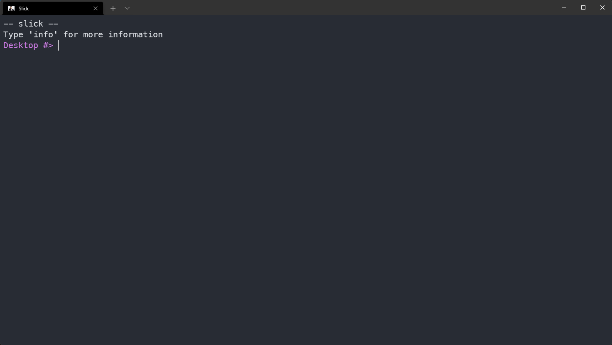

# slick
A simple UNIX shell written in C

## How to install
Run `make slick` to generate an executable in `/usr/bin/`
This will also generate a `.ssrc` file, which you can use to customize commands that run when the shell is launched
